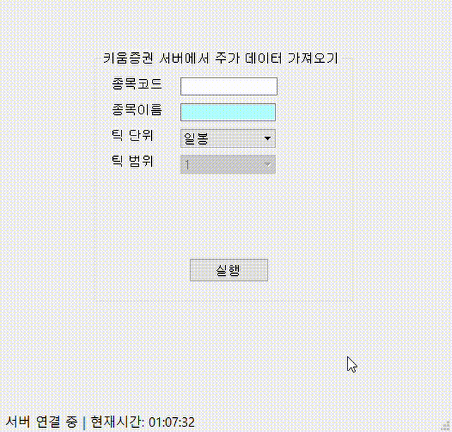
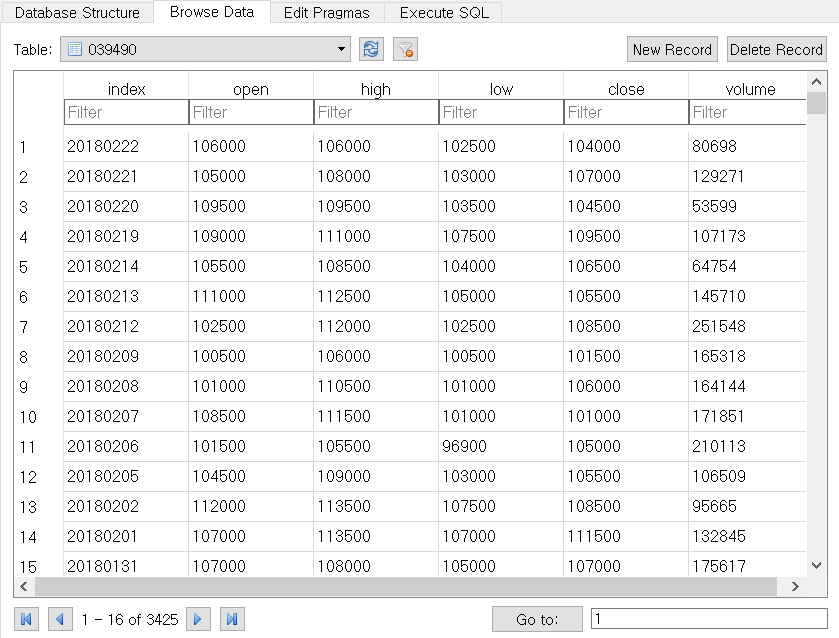
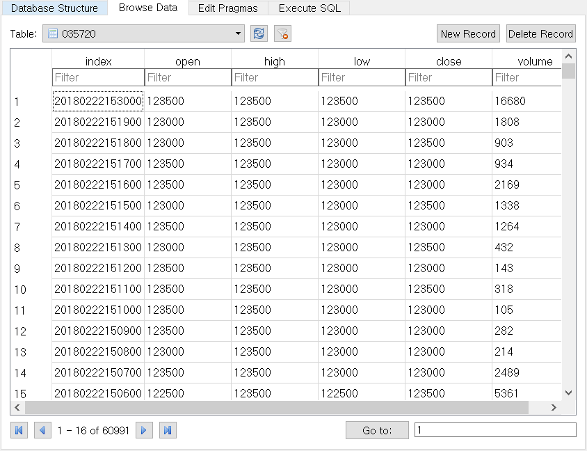

# Kiwoom_datareader
키움증권 Open API를 사용하여 주가 데이터를 받아오는 PyQt 기반의 프로그램입니다.

데이터를 받아오는 기능만 구현하려한 것이 아니기때문에, 재사용성과 확장성을 염두에 두고 개발하였습니다.
프로그램 기능을 확장할 예정이므로 binary file로 배포하지 않습니다.

[파이썬으로 배우는 알고리즘 트레이딩]를 참고하여 구현하였습니다.

[파이썬으로 배우는 알고리즘 트레이딩]:https://wikidocs.net/book/110

## 실행 / 개발 환경

[파이썬으로 배우는 알고리즘 트레이딩]을 참고하시기 바랍니다.

1. 키움증권 가입 & 키움증권 Open API 사용 허가 & Open API 모듈 설치
2. Anaconda 32-bit 설치
	만약 Anaconda 64-bit을 사용하고 있는 경우
    - 32-bit도 설치 또는,
    - `set CONDA_FORCE_32BIT`을 이용하여 32-bit 가상환경을 만들어야 합니다.
3. 32-bit anaconda 가상환경에서 `python=3.5`, `pyqt5`, `sqlite3`, `pandas` 설치
    

## Preview
##### 실행화면

##### 일봉 데이터 (SQLite3로 저장)

##### 분봉 데이터 (SQLite3로 저장)

---

##### *키움증권 OPEN API제한사항*
(2018.02.20 기준)
현재 키움증권 OPEN API는 **분봉** 데이터를 조회 시점 기준으로 약 160일 전 까지의 데이터를 제공합니다.
데이터 개수로는 약 60000분 의 데이터입니다.

원했던 것 보다 데이터 양이 적기 때문에, 과거 분/틱 단위 데이터를 받아오는데에는 적합하지 않다고 생각합니다.

더 많은 데이터를 제공하는 증권사를 이용해볼 생각입니다.
+ (18.02.23 내용추가)
	대신증권 Plus API에서는

	1분봉 약 18.5만개(약 2년치 데이터) 조회 가능. 
	5분봉 약 9만개(약 5년치 데이터) 조회 가능. 
	https://github.com/gyusu/Creon-Datareader

